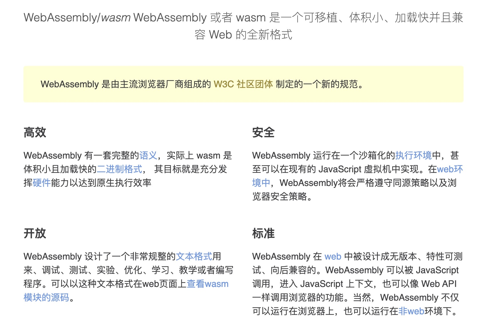
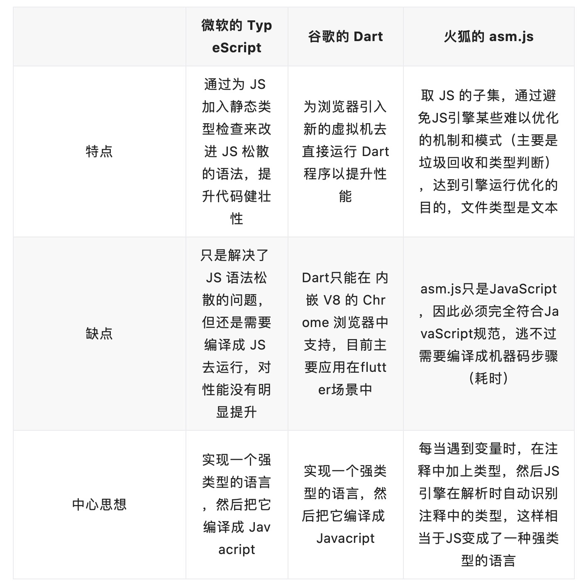

# WebAssembly

## 一、WASM 背景知识

### 1. WASM 是什么

WebAssembly 是一种底层类汇编语言，能在 Web 平台上以趋近原生应用的速度运行。C/C++/Rust 等语言将 Wasm 作为编译目标语言，可以将已有的代码移植到 Web 平台中运行，以提升代码复用度。

> **High-Level -> Assembly -> Binary**

官网上所说的特性：


而 Wasm 官网给出的定义是 —— WebAssembly（缩写为 Wasm）是一种基于栈式虚拟机的二进制指令格式。Wasm 被设计成为一种编程语言的可移植编译目标，可以通过将其部署到 Web 平台上，使其为客户端和服务端应用程序提供服务。

### 2. 发展历史

1995 年，大神布兰登·艾奇（Brendan Eich），仅仅花了 10 天 就将伟大的 JavaScript 撸出来了，引起了轰动。但是 Js 的设计初衷是想设计出一个面向非专业编程人员和网页设计师的解释型语言。由于时间太短，细节考虑的不够周全，导致留下很多坑，所以后来很长一段时间，JavaScript 的执行速度一直备受诟病。

2008 年，浏览器的性能大战打响，众多浏览器引入了即时（JIT）编译使得 JavaScript 运行速度快了一个量级。但是对于 JavaScript 这种弱数据类型的语言来说，要实现一个完美的 JIT 非常难。因为 Javascript 是一个没有类型的语言，而且像+这样的符号又能够重载，譬如这样的代码：

```js
const sum = (a, b, c) => a + b + c;
```

这是 一个求和函数，可以直接放在浏览器的控制台下运行，如果传参都是整数时，结果是整数相加的结果：如，答案是 6。但是，如果至少有一个是字符串，则结果是按照字符串拼接出的结果，如 console.log(sum('1',2,3))，答案是 "123"。也就是说，JIT 在遇到第一个 sum 时会编译成整数相加的机器码；但是在碰到第二个 sum 调用时，不得不重新编译一遍。这样一来，JIT 带来的效率提升便被抵消了。

随着 JS 达到了性能天花板，在当前复杂密集运算及游戏面前已完全力不从心。无法满足一些大型 web 项目开发，于是三大浏览器巨头分别提出了自己的解决方案：


我们熟知的四大主流浏览器厂商 Google Chrome、Apple Safari、Microsoft Edge 和 Mozilla FireFox ,觉得 Mozilla FireFox 所推出的 asm.js 很有前景，为了让大家都能使用，于是他们就共同参与开发，基于 asm.js 制定一个标准，也就是 WebAssembly。

- 2015 年， WebAssembly 首次发布，并可直接在浏览器中运行
- 2017 年 3 月份， 四大厂商均宣布已经于最新版本的浏览器中支持了 WebAssembly 的初始版本，这意味着 WebAssembly 技术已经实际落地
- 2019 年，被正式加入 Web 的标准大家庭中

### 3. 工作原理

JavaScript 的问题

JavaScript 是解释型语言，也是动态类型语言。如果变量类型是在运行时决定的，那么就是动态类型语言。
相对于动态类型语言，还有静态类型语言，C++就是一种静态类型语言，其变量类型是在定义的时候就决定了的。

通过一条指令，编译器就能知道变量 x 的类型和内存位置。但是对于 JavaScript 中相同的操作，每次执行程序时，引擎都必须检查它是整数还是浮点数，或者任何其他有效的数据类型。所以 JavaScript 中的每条指令都要经过几次类型检查和转换，这会影响到它的执行速度。

JavaScript 运行代码花费时间：


WASM 运行花费时间：


- **JavaScript**：在浏览器中，对 JavaScript 源码进行解析，生成抽象语法树或者字节码（parse），JIT 编译器会对生成的代码进行编译优化，当然后当发生去优化时，再去重新编译优化，最后执行。

- **WebAssembly**：则省去了比较耗时的解析和编译的过程，是直接生成的二进制可执行机器码进行执行。

### 4. 哪些语言可以编译 WASM

- C/C++之类的语言编写模块时，你可以使用 **Emscripten** 来将它编译到 WebAssembly。

- Rust 语言编写模块时，需要一个额外工具 wasm-pack。它会把代码编译成 WebAssembly 并制造出正确的 npm 包

- Java 语言来编写模块时，TeaVM 可以将 JVM 字节码翻译成

- php 语言来编写模块时，php2wasm 可以把 PHP 代码编译成 wasm，现在还不成熟

- 保持 js 的编写风格，那就用 typescript 来编写吧，用 **AssemblyScript** 来生成 wasm

### 5. WASM 如何在浏览器中使用

相关 api: [https://webassembly.org/](https://webassembly.org/)
浏览器支持：https://caniuse.com/?search=WebAssembly

推荐一个名为 WebAssembly Code Explorer 的站点，可以更直观地查看 Wasm 二进制格式和文本格式之间的关联。
[https://wasdk.github.io/wasmcodeexplorer/](https://wasdk.github.io/wasmcodeexplorer/)

### 6. WASM 能做什么

浏览器端：

- 游戏

- 科学的可视化和模拟

- IDE、CAD 应用

- 浏览器端的图像/音视频处理

- AR/VR

非浏览器端：

- Serverless、区块链、IoT 等领域

## 二、AssemblyScript 实践 DEMO

### 1. 搭建

根据官网文档操作即可

```shell
#添加监视脚本
npm install --save-dev onchange
"asbuild:watch": "onchange -i 'assembly/**/*' -- npm run asbuild"
```

### 2. 编译

根据官网文档操作即可

### 3. 测试

```shell
#基准测试
npm install --save-dev benchmark
```

```js
// benchmark.js
import Benchmark from "benchmark";
import { assemblyFunc } from "xx";
function jsFunc(x) {}
const suite = new Benchmark.Suite();
const startNumber = 2;
const stopNumber = 10000;

suite
  .add("AssemblyScript func", function () {
    for (let i = startNumber; i < stopNumber; i++) {
      assemblyFunc(i);
    }
  })
  .add("JavaScript func", function () {
    for (let i = startNumber; i < stopNumber; i++) {
      jsFunc(i);
    }
  })
  .on("cycle", function (event) {
    console.log(String(event.target));
  })
  .on("complete", function () {
    const fastest = this.filter("fastest");
    const slowest = this.filter("slowest");
    const difference =
      ((fastest.map("hz") - slowest.map("hz")) / slowest.map("hz")) * 100;
    console.log(`${fastest.map("name")} is ~${difference.toFixed(1)}% faster.`);
  })
  .run();
```

### 4. 简单测试性能：和 JS 代码进行对比

---

**参考链接**

1. assemblyscript: _[https://www.assemblyscript.org/](https://www.assemblyscript.org/)_
2. wasm 中文:_[https://www.wasm.com.cn/](https://www.wasm.com.cn/)_
3. webassembly: _[https://webassembly.org/](https://webassembly.org/)_
4. MDN WebAssembly: _[https://developer.mozilla.org/en-US/docs/WebAssembly](https://developer.mozilla.org/en-US/docs/WebAssembly)_
5. jixiaohua cnblogs: _[https://www.cnblogs.com/jixiaohua/p/10447701.html](https://www.cnblogs.com/jixiaohua/p/10447701.html)_
6. 参考文章: _[https://wanghi.cn/202003/19319.html](https://wanghi.cn/202003/19319.html)_
7. 参考文章: _[https://mp.weixin.qq.com/s/vI8sNWibmv44MJuVkiQAew](https://mp.weixin.qq.com/s/vI8sNWibmv44MJuVkiQAew)_
8. webassembly example: _[WebAssembly 学习例子](https://wasmbyexample.dev/home.en-us.html#)_
